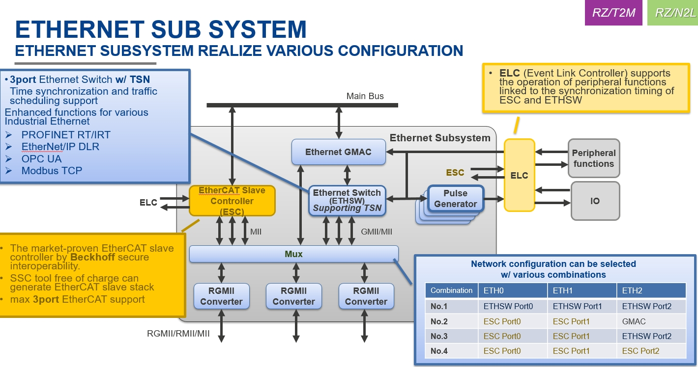
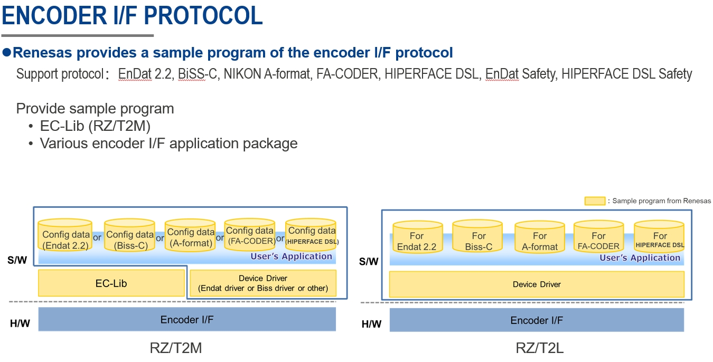

一、从0开始卷出一个新项目之瑞萨RZT2M对比介绍
===
[toc]
# 一、概述
- 瑞萨RZT2M和RZN2L属于同一个系列芯片，所以基本用法请参见：[从0开始卷出一个新项目之瑞萨RZN2L](https://mp.weixin.qq.com/mp/appmsgalbum?__biz=MzkxNDQyMTU4Mg==&action=getalbum&album_id=3167963498191110153#wechat_redirect)

- 本系列主要介绍区别的功能
- 本节通过与RZN2L的对比来介绍RZT2M芯片
- 总结核心区别：单核400Mhz--->双核800Mhz

# 二、相关资料
- 官网资料：https://www.renesas.cn/zh/products/microcontrollers-microprocessors/rz-mpus/rzt2m-high-performance-multi-function-mpu-realizing-high-speed-processing-and-high-precision-control
- 数据手册：[rzt2m-group-datasheet.pdf](./doc/rzt2m-group-datasheet.pdf)
- 用户手册：[RZ/T2M Group User's Manual: Hardware](./doc/r01uh0916ej0120-rzt2m.pdf)
- [RZ/T2M Easy Download Guide](./doc/r01uh0916ej0120-rzt2m.pdf)

# 三、RZT2M对比RZN2L介绍

## 3.1 框图对比

## 3.2 表格对比

## 3.3 Roadmap

## 3.4 典型应用：总线型伺服电机

## 3.5 千兆以太网交换机

## 3.6 绝对值编码器

## 3.7 芯片part number

## 3.8 开发板

# 四、总结
- 核心：CR52双核800Mhz
- RZT2M、RZN2L 225引脚pin2pin
- 应用：3 端口的千兆以太网交换机，可为 TSN 标准及 EtherCAT、PROFINET RT/IRT 和 EtherNet/IP 等工业以太网协议 的 高性能伺服电机