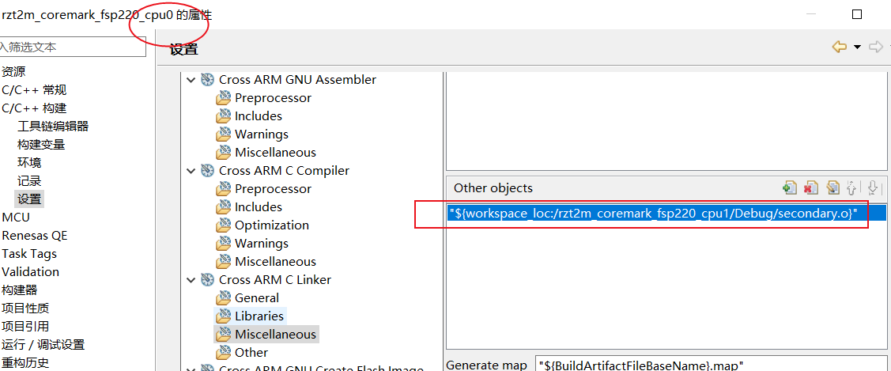

二、从0开始卷出一个新项目之瑞萨RZT2M双核架构通信和工程构建
===
[toc]
# 一、概述
- RZT2M双核架构是同构多核，但双核针对不同应用
- 扩展多核架构和通信知识可参见[嵌入式科普(30)一文看懂嵌入式MCU/MPU多核架构与通信](https://mp.weixin.qq.com/s/fiE6fe25XiGJ6cycp0jCXA?token=688789633&lang=zh_CN)

# 二、参考资料
- 用户手册：[RZ/T2M Group User's Manual: Hardware](../1_t2m%20vs%20n2l/doc/r01uh0916ej0120-rzt2m.pdf)
- R52内核手册：[arm_cortex_r52_processor_trm](./doc/arm_cortex_r52_processor_trm_100026_0104_00_en.pdf)

# 三、RZT2M双核架构和通信

## 3.1 R52内核GIC-SCI


## 3.2 RZT2M信号量


## 3.3 架构通信示意图


```
fsp_err_t R_SHARED_MEMORY_Read (shared_memory_ctrl_t * const p_ctrl,
                                uint8_t * const              p_dest,
                                uint32_t const               offset,
                                uint32_t const               bytes)
{
    shared_memory_instance_ctrl_t * p_instance_ctrl = (shared_memory_instance_ctrl_t *) p_ctrl;
    volatile uint32_t               resource_status = 0;

#if SHARED_MEMORY_CFG_PARAM_CHECKING_ENABLE
    FSP_ASSERT(p_instance_ctrl != NULL);
    FSP_ASSERT(p_dest != NULL);

    /* Return an error if this module have already been opened */
    FSP_ERROR_RETURN(SHARED_MEMORY_OPEN == p_instance_ctrl->open, FSP_ERR_NOT_OPEN);
#endif

    if ((p_instance_ctrl->p_cfg->memory_size < (offset + bytes)) || (p_instance_ctrl->p_cfg->memory_size < offset) ||
        (p_instance_ctrl->p_cfg->memory_size < bytes))
    {
        return FSP_ERR_INVALID_ARGUMENT;
    }

    resource_status = r_shared_memory_read_resource_status(p_instance_ctrl->p_cfg->semaphore_reg);
    if (0x00000000 == resource_status) // wait Shared memory available
    {
        return FSP_ERR_IN_USE;
    }

    memcpy(p_dest, &p_instance_ctrl->p_cfg->p_memory[offset], bytes);

    r_shared_memory_release_resource(p_instance_ctrl->p_cfg->semaphore_reg); // Shared memory becomes available

    if (SHARED_MEMORY_STATE_READY_TO_READ_WRITE == p_instance_ctrl->state)
    {
        p_instance_ctrl->state = SHARED_MEMORY_STATE_READY_TO_WRITE;
    }

    return FSP_SUCCESS;
}

/******************************************************************************************************************//**
 * Performs a write to the shared memory. Implements @ref shared_memory_api_t::write().
 *
 * @retval  FSP_SUCCESS        Function executed without issue.
 * @retval  FSP_ERR_ASSERTION  p_ctrl or p_src is NULL.
 * @retval  FSP_ERR_INVALID_ARGUMENT    Invalid input parameter.
 * @retval  FSP_ERR_IN_USE     Another transfer was in progress.
 * @retval  FSP_ERR_NOT_OPEN   Module is not open.
 *********************************************************************************************************************/
fsp_err_t R_SHARED_MEMORY_Write (shared_memory_ctrl_t * const p_ctrl,
                                 uint8_t * const              p_src,
                                 uint32_t const               offset,
                                 uint32_t const               bytes)
{
    shared_memory_instance_ctrl_t * p_instance_ctrl = (shared_memory_instance_ctrl_t *) p_ctrl;
    volatile uint32_t               resource_status = 0;

#if SHARED_MEMORY_CFG_PARAM_CHECKING_ENABLE
    FSP_ASSERT(p_instance_ctrl != NULL);
    FSP_ASSERT(p_src != NULL);

    /* Return an error if this module have already been opened */
    FSP_ERROR_RETURN(SHARED_MEMORY_OPEN == p_instance_ctrl->open, FSP_ERR_NOT_OPEN);
#endif

    icu_inter_cpu_irq_instance_t * p_software_int_tx =
        (icu_inter_cpu_irq_instance_t *) ((shared_memory_extended_cfg_t *) p_instance_ctrl->p_cfg->p_extend)->
        p_software_int_tx;

    if ((p_instance_ctrl->p_cfg->memory_size < (offset + bytes)) || (p_instance_ctrl->p_cfg->memory_size < offset) ||
        (p_instance_ctrl->p_cfg->memory_size < bytes))
    {
        return FSP_ERR_INVALID_ARGUMENT;
    }

    resource_status = r_shared_memory_read_resource_status(p_instance_ctrl->p_cfg->semaphore_reg);
    if (0x00000000 == resource_status) // wait Shared memory available
    {
        return FSP_ERR_IN_USE;
    }

    memcpy(&p_instance_ctrl->p_cfg->p_memory[offset], p_src, bytes);
    __asm("dmb sy");                                                         /*Ensuring data-changing */

    r_shared_memory_release_resource(p_instance_ctrl->p_cfg->semaphore_reg); // Shared memory becomes available

    p_software_int_tx->p_api->generate(p_software_int_tx->p_ctrl);

    return FSP_SUCCESS;
}
```

# 四、双核工程
使用e2studio 2024-10 RZN-fsp2.2.0，可以直接新建向导RZT2M双核工程。小于等于2.0版本不可。

## 4.1 CPU1工程设置


```
arm-none-eabi-objcopy -I elf32-littlearm -O binary ${ProjName}.elf secondary.bin && arm-none-eabi-objcopy -I binary -O elf32-littlearm -B arm --rename-section .data=.secondary,alloc,data,readonly,load,contents secondary.bin secondary.o
```

## 4.2 CPU0工程设置



```
"${workspace_loc:/rzt2m_coremark_fsp220_cpu1/Debug/secondary.o}"
```
## 4.3 工程编译
  

## 4.4 双核启动


# 五、总结
- RZT2M同构双核，分主副core
- 两个工程关联在一起(fsp2.2.0)
- 先启动cpu0，后启动cpu1(fsp2.2.0)